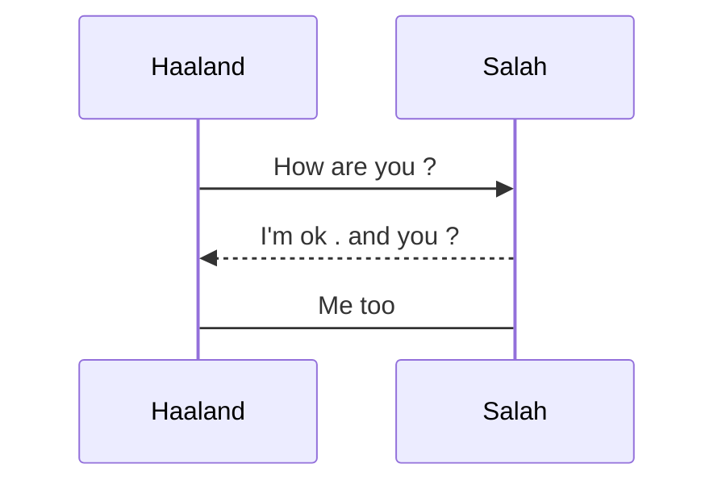

# H1
## H2
### H3
#### H4
##### H5
###### H6

# oder list
1. one
1. two
1. three

# Unordered
- Line 1
- Line 2
- Line 3

# Italics

*Hi2en*

# Underline

__Hi2en__

# Image


# table
Code | Name | Age |
---- | ---- | ----|
001 | Haaland | 25 |
#
```javascript
let a=0;
```
#
```python
print("Haaland Cool")
```
#

